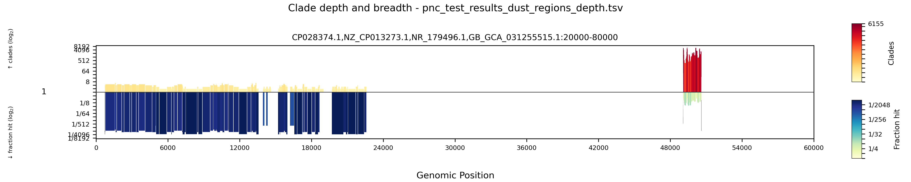

# alasight

ALASIGHT - **A**pproximate **L**ocal **A**lignment for **SIG**natures of **H**orizontal **T**ransfer.
A tool for detecting signatures of horizontal gene transfer, which might signal the presence of Mobile Genetic Elements (MGEs) using alamem and phylogenetic divergence analysis.
## Overview

Alasight finds signatures of horizontal gene transfer by using alamem to find all hits of a query sequence across a GTDB database, applying divergence filtering, and then running an overlap-divergence filter to identify regions supported by alignments to distantly related species. It uses the TimeTree of Life to calculate divergence times, and skani for average nucleotide identity (ANI) lookups. We designed this tool to detect HGT signatures, with the goal of finding novel MGEs that may not be within a reference MGE databases. 

## Requirements

- **conda** — `setup.sh` uses it to create the environment.

## Installation

```bash
git clone https://github.com/graceoualline/alasight.git
cd alasight
bash setup.sh
export PATH="$HOME/bin:$PATH"            
conda activate alasight
```

`setup.sh` creates the `alasight` conda environment required to run the software, downloads the prebuilt alamem aligner, and decompresses required reference files shipped in `references-compressed/`
(the TimeTree of Life newick and the GTDB-NCBI species table). 

### alamem

alamem is required (alasight calls it internally). `setup.sh` installs it automatically.

- **Prebuilt binary (default):** works on Linux x86-64 / ARM. `setup.sh` downloads it for you.
- **Build from source:** `BUILD_ALAMEM=1 bash setup.sh`. Requires rust ([https://rustup.rs](https://rustup.rs)) and a C compiler. Use this if the prebuilt binary doesn't run on your system. See the [alamem repository](https://github.com/yunwilliamyu/alamem) for full build details.

### Building the GTDB database

Running alasight requires a database. By default alasight uses GTDB r214, for setup run:

```bash
mkdir work_dir
bash build_gtdb_db.sh work_dir <threads>
```

**Resources and timing.** The build has three stages: scanning the genomes, indexing, and building the skani sketch.  

Guidance:

- **Threads:** the FASTA scan and skani sketch both parallelize, ~16 is ideal.
- **Memory:** ~32GB is recommended for the full GTDB build. 
- **Resumable:** every step is skipped if its output already exists, so re-running the same command after an interruption continues where it left off. If you already have the GTDB genomes downloaded and extracted, place them as `<workdir>/gtdb_genomes_reps_r214/` and the script skips the download.

### Creating a Custom Database

If you want to use your own genome collection, you only need the following files:
- sequence_id_to_species_id.txt (in TSV format)
- species_tree.nwk (in Newark file format)
- fasta_list.txt (pointing to all the fasta files to be indexed)
```bash
./alasight.py build-db -i fasta_list.txt -d database -tr tree -n species_tree.nwk -s sequence_id_to_species_id.txt -t 64 [--representatives]
```
If you can guarantee that your genome collection is all separate species, as it is in the GTDB r214 representative genomes collection which we use, you should set --representatives. This way we can assume that everything is distinct and don't need to run an additional 95\% ANI check.
## Usage

```bash
# see all options
./alasight.py -h

# run a query against the database
./alasight.py run -d <workdir>/database -q input.fasta -o out_dir -t <cores>

# EXAMPLE / TEST
# should take 2 minutes using 46 threads
./alasight.py run -d work_dir/database -tr work_dir/tree -q test/plasmid_and_conserved_example.fasta -o test/pnc_test_results/ -t 46
```
#### Visualization

```bash
# Visualize alasight output as an interactive mirror plot or png
python3 helper/alasight_plot.py mirror out_dir/<name>_dust_regions_depth.tsv <out_name>.html
python3 helper/alasight_plot.py mirror out_dir/<name>_dust_regions_depth.tsv <out_name>.png

# EXAMPLE
# if you ran the test above, you can visualize it with the following command
python3 helper/alasight_plot.py mirror test/pnc_test_results/pnc_test_results_dust_regions_depth.tsv test/pnc_test_results/plasmid_and_conserved.html #or .png
# should see a plasmid inserted between 719 to 22593, and a 16S protein from 49063 to 50588
```


### alasight Parameters 

#### Required Arguments
| Parameter | Description |
|-----------|-------------|
| `-q, --query` | Path to the query FASTA file |
| `-o, --output` | Name of your output directory |
| `-d, --database` | Path to the alasight database directory |

#### Optional Arguments
| Parameter | Default | Description |
|-----------|---------|-------------|
| `-tr, --tree` | from database| Path to the preprocessed tree directory (defaults to the tree the database was built against).* | 
| `-t, --threads` | 1 | Number of threads. **Highly recommended to increase.** |
| `-s, --species-file` | auto-detect | Tab-separated file assigning a species to each sequence ID. Cannot be used with `--species`. |
| `--species` | auto-detect | Species name for all sequences in the input FASTA (replace spaces with `_`). Output metadata only, doesn't affect hits. |
| `--min-len` | 40 | Minimum length of alamem hit. |
| `--min-ani` | 96 | Minimum percent identity: `(matches / (Q_end − Q_start)) × 100`. |
| `--size-filter` | 150 | Discard final regions smaller than this many bp. |
| `--cluster-size` | 0 | Merge final regions within this many bp of each other. |

\* We use the Time Tree of Life to calculate divergence times between species. If a new .nwk file from the Time Tree becomes available, you can use `build-tree` directly (normally it is called indirectly from `build-db`).

## Filters
Filters are described in further detail, and their processes are illustrated in our paper (add cite).
### ANI/Divergence Filtering
- ANI divergence filtering is the initial method for detecting HGT and produces the file ```{output_name}_first_div_output.tsv```. 
- We examine the ANI between the query genome and the genome it aligned to, and only retain if the ANI <= 95%, a typical species boundary.
- This filter is effective at identifying horizontal gene transfer events because MGEs transferred between distantly related species will show high sequence similarity despite ancient species divergence.
- For detailed information on how this filter detects horizontal gene transfer, please refer to our paper: (citation tba).
### Overlap-Divergence Filtering (always runs)
This filter produces ```{output_name}_overlap_div.tsv```:
- Finds pairs of hits that overlap on the query sequence and whose reference sequences are divergently distant from each other (≥ 1 MYA), or have ANI < 95% when divergence time is unknown.
- Removes false positives caused by self-alignments or hits from closely related organisms.
- ANI between reference sequence pairs is looked up via skani triangle on all the hit genomes.

### Size and Cluster Filtering (always runs)
Final regions are built from the overlap-div output:
- Intervals within `--cluster-size` bp of each other are merged (default: 0 bp)
- Regions smaller than `--size-filter` bp are discarded (default: 150 bp)

### Output Files

`run` writes several files into the output directory, in pipeline order:

```
output_directory/
├── <name>_alamem_results.tsv            # raw alamem hits
├── <name>_first_div_output.tsv          # hits kept by the ANI filter
├── <name>_overlap_div.tsv               # overlapping hit pairs from different clades
├── <name>_clustered_regions.tsv         # merged / size-filtered / clustered regions
├── <name>_clustered_regions_summary.tsv # one row per clustered region
├── <name>_clustered_regions_depth.tsv   # regions cut at every depth change
├── <name>_dust_regions.tsv              # regions left after DUST masking
├── <name>_dust_regions_summary.tsv      # one row per surviving region
└── <name>_dust_regions_depth.tsv        # regions cut at every depth change
```


The `_dust_regions*` files are the final output (after low-complexity masking); the `_clustered_regions*` files are the same regions before dustmasking. All files begin with a `#`-prefixed configuration header recording the run's parameters and timestamp.

### Visualization Parameters
`helper/alasight_plot.py` has four modes:

```bash
python3 helper/alasight_plot.py <mode> <input.tsv> <output> [options]
```

| Mode | Input | Description |
|------|-------|-------------|
| `mirror` | `<name>_dust_regions_depth.tsv` | Depth above the axis, breadth below it. Both are log2, so the two halves are directly comparable. |
| `depth` | `<name>_dust_regions_depth.tsv` | Number of clades supporting each position, drawn as log2(depth). |
| `fraction` | `<name>_dust_regions_depth.tsv` | How sparsely the LCA subtree was hit, drawn as −log2(Tree Leaves Hit / Tree Leaves In LCA). Vertically inherited genes stay flat; transferred genes stand tall. |
| `area` | `<name>_dust_regions_summary.tsv` | Every region shaded, labelled with its clade count. |

The output format follows the file extension: `.html` gives an interactive page (`mirror`, `depth` and `fraction` only), `.png` a raster image, and `.svg` or no extension a vector image.

#### Options for all modes
| Parameter | Default | Description |
|-----------|---------|-------------|
| `--fasta` | none | FASTA to take sequence lengths from, when the TSV has no `Q size` column. |
| `--only` | all | Plot only these sequences 1-based panel numbers, e.g. `3,7,12`. |
| `--known` / `--no-known` | auto-detect | Treat query names as `plasmid_id,start,end,host_id` and mark the known plasmid region. |
| `--dpi` | 300 | Raster resolution. Ignored for vector output. |
| `--no-compact` | off | Skip the SVG path-data rewrite. |
| `--svg-precision` | none | Round SVG coordinates to this many decimals. |

#### Mode-specific options
| Mode | Parameter | Default | Description |
|------|-----------|---------|-------------|
| `mirror` | `--min-depth` | 0 | Only plot queries reaching this depth somewhere. |
| `mirror` | `--max-fraction` | none | Only plot queries reaching a fraction at or below this somewhere. |
| `mirror` | `--ticks` | auto | Fix the axis to this many ticks on each side (top 2^N, bottom 1/2^N). Use the same value to compare figures across samples; bars beyond it are clipped. |
| `depth` | `--min-depth` | 0 | Only plot queries reaching this depth somewhere. |
| `depth` | `--linear` | off | Plot raw clade counts instead of log2. |
| `fraction` | `--max-fraction` | none | Only plot queries reaching a fraction at or below this somewhere. |
| `fraction` | `--linear` | off | Plot 1 − fraction instead of −log2(fraction). |
| `area` | `--size-filter` | 0 | Drop regions shorter than this many bp. |
| `area` | `--cluster` | 0 | Merge regions within this many bp of each other. |


### Resume Functionality
Important: The program is designed to resume from interruptions by checking for existing files. If a run is stopped prematurely, it will restart from where it left off. Avoid creating files with names that could overlap with alasight's output to prevent conflicts.


## Workflow

**alamem alignment:** the query is aligned against the streamed reference database.

**Divergence filter:** Retains hits with >=96% ANI (configurable) where query and reference species have <=95% ANI.

**Overlap-divergence filter:** Identifies overlapping hit pairs whose reference sequences are from divergent lineages (<=95% ANI or >= 1 MYA). Always runs. Note that if you choose representative genomes, this is just an overlap filter, and so we won't recompute divergence when using GTDB representative genomes. The divergent lineage option is there in case you use a non-representative genome set.

**Size + cluster filter:** Merges nearby regions and removes small ones.

**Dustmasker filter:** Removes low-complexity regions.

**Depth + Sparsity computation:** This produces a new depth chart, where instead of listing hits, we instead measure how many hits there are that support each interval of the genome being HGT. Running `alasight_plot.py mirror <name>_dust_regions_depth.tsv depth.html` generates an interactive HTML view of the genome and the depth of support across each region, and the sparsity of that support within the subtree containing all the hits for the region as well.


## Performance Tips
1. **Use many threads:** `-t 64` or higher significantly speeds up alamem and skani steps.
2. **Resume feature:** Take advantage of the automatic resume capability for the build-db — re-running the same command after an interruption picks up from where it left off.


## Citation and Data

If you use alasight in your research, please cite:
[Add later]

All data used in the publication is avaliable here: https://github.com/graceoualline/alasight_testdata

## Support

For questions and support, please submit an issue ticket on the GitHub repository.
